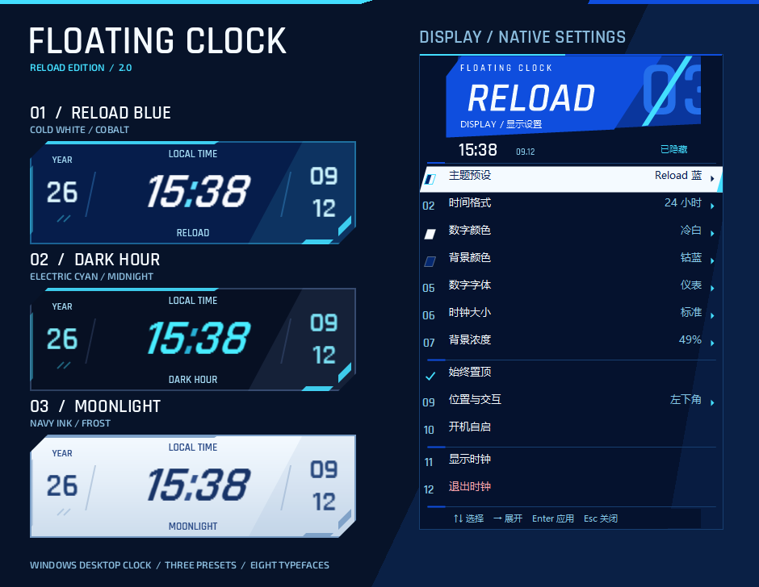
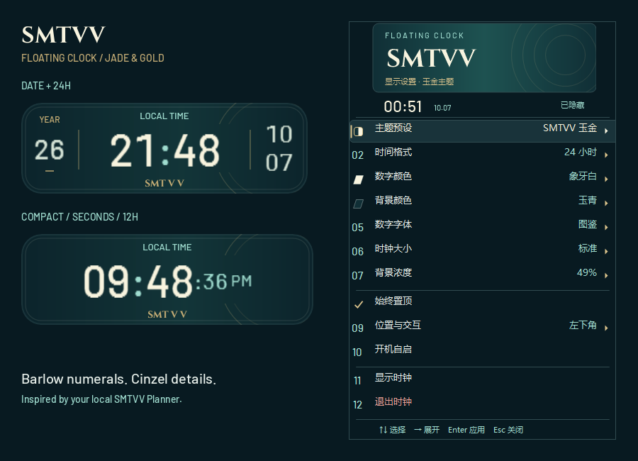

# Floating Clock · Reload & SMTVV

轻量的 Windows 原生悬浮时钟。无边框、常驻托盘、置顶，并随当前用户开机启动。

提供《女神异闻录 3 Reload》的蓝白主题，以及参考本地 SMTVV Planner 的玉青金色主题。年份在左，时间居中，月份和日期在右侧上下排列。右键与托盘共用一套中文菜单。





## 2.1 主题与菜单

- **Reload 蓝**：冷白数字、钴蓝透明背景、倾斜的仪表字体；新安装默认使用。
- **深夜青**：电光青数字、深空透明背景，搭配 `DARK HOUR` 标记。
- **月光白**：藏青数字、雾蓝实色背景，搭配 `MOONLIGHT` 标记。
- **SMTVV 玉金**：参考 SMTVV Planner 的深玉青渐变、象牙白数字、香槟金细线、圆角面板和圆环装饰。使用 Barlow 图鉴字体；菜单同步切换为象牙白标题、玉青背景与金边选中条。
- 右键 → **主题预设** 即可切换。预设一次应用数字色、背景色和字体，保留大小、透明度、时间格式、位置及交互偏好。手动修改配色或字体后，菜单显示「自定义」。
- Reload 系列菜单使用 `RELOAD` 标题、斜切白色选中条与青色标记；SMTVV 使用 Cinzel 标题与金色细节。两套菜单均提供实时状态栏、键盘提示、颜色色块和实际字体数字示例。
- 时钟装饰使用本地矢量绘制，字体随应用分发；不依赖网络、图片素材或额外动画定时器。SMTVV 的玉青渐变支持背景浓度，数字保持不透明；手动更换数字颜色或字体后，仍保留玉青背景的装饰与菜单风格。
- 升级保留已有设置；选择「主题预设 → SMTVV 玉金」即可使用新增主题。1.9.1 的可靠性修复也包含在此版本中。

## 使用

- 左键拖动时钟；右键打开全部设置。默认开机自启，并停在当前屏幕工作区左下角（任务栏上方）。
- 托盘图标可显示/隐藏时钟，并包含与窗口右键相同的设置（穿透模式下也能改选项）。
- 可切换日期、数字秒钟、24 小时制、数字颜色、背景颜色、字体、六档大小和背景浓度。深色背景使用真实逐像素透明，透明度由设置固定且不随鼠标移动改变，数字不透明。显示和鼠标交互共用一个原生分层窗口，避免重叠窗口重复合成；浅色背景仍是不透明实色。
- 字体：赛博、锐线、终端、几何、仪表、霓虹、冰岛、电刻、图鉴（Barlow Medium）。新增「象牙白」数字和「玉青」背景。大小有迷你、小、标准、大号、很大、超大。
- 右键/托盘菜单随当前背景切换 Reload 蓝白或 SMTVV 玉金样式，顶部显示本地时间和交互状态。主菜单直接显示当前主题、字体、配色、大小等选择，子菜单提供颜色色块、实际字体数字示例及选中标记。
- 调整时间格式、颜色、字体和大小时菜单保持打开，可连续比较。位置与交互集中在一组；浅色实色背景会禁用背景浓度，并说明原因。支持方向键、Enter 选择和 Esc 关闭。
- 「锁定位置」防止误拖动；「鼠标穿透」允许点击下方窗口。按 `Ctrl+Alt+T` 或单击托盘图标可关闭穿透。热键被占用时会提示，并改用托盘菜单。
- 「复位到右上角」回到**当前显示器**工作区右上角，而不是强制回到主屏。
- 关掉日期后两侧年份/日期列会收起，窗口变窄。年份和月/日数字比时间略小一档，但仍保持清晰可读。
- 打开秒钟时 `HH:mm` 保持大号，秒钟以较小字号跟在后面。12 小时制使用 `AM` / `PM`。
- 点击或拖动时钟默认不抢焦点，方便叠在正在输入的窗口上。
- 拖动后自动转为自由位置，重启保留位置；点击但未移动仍保持停靠。隐藏后可从托盘恢复，拖动中断或跨分钟后会立即补刷时间。
- 不显示秒钟时按整分钟刷新，隐藏时暂停时钟定时器；恢复显示、系统校时和睡眠唤醒时立即更新。
- 多屏位置按物理像素保存，按所在显示器的 DPI 绘制；显示器拔出或排列变化时会回到实际可见的工作区。旧版位置在首次升级时转换一次。
- 设置保存在 `%LOCALAPPDATA%\FloatingClock\settings.xml`。升级版本时会保留你已选的主题、大小、秒钟等选项。
- 开机自启开关立即保存。升级安装保留关闭状态，包括旧版已移除快捷方式但尚未保存开关的情况。

## 1.9.1 可靠性更新

- 设置损坏、无法读取或来自更新版本时保留原文件，使用临时设置运行，不自动覆盖或更改自启。有效的 `settings.xml.bak` 可用于本次只读恢复；菜单显示临时设置状态。修复文件后重启即可恢复保存。
- 原子保存保留上次有效备份，内容未变时不重复写盘；保存失败会提示。开机启动开关与配置保存联动，保存失败尝试回滚启动项，避免下次启动悄悄反转偏好。
- 关闭置顶后，托盘仍可把时钟带到普通窗口前面且不抢焦点。工作区、显示器或 DPI 在拖动中变化时延后处理，松手不再跳回旧停靠点。
- 修复跨秒/分钟刷新竞争、极端坐标、旧系统 DPI 清单和 64 位 DWM 结构；字体解析缓存复用，减少反复查找字体与无变化设置落盘。
- 新版实例使用激活确认和互斥体所有权处理退出并发；与 1.9.0 及更早版本同时运行时仍保留旧激活协议，旧实例退出竞争不在新协议保证范围内。

## Chrome 硬件合成兼容性

部分 Windows、AMD 显示驱动和 Chrome 组合在 DirectComposition/MPO 路径下，会出现只在物理屏幕可见、截图无法捕获的透明窗口亮度闪烁。此时需完全退出 Chrome（包括后台进程），并使用以下参数重新启动：

```text
--disable-direct-composition
```

可将该参数追加到 Chrome 快捷方式的“目标”末尾。它只切换 Chrome 的显示合成路径，不会把 Floating Clock 的背景改成不透明。

## 重新编译和安装

在 Windows PowerShell 中运行：

```powershell
powershell -NoProfile -ExecutionPolicy Bypass -File .\build.ps1 -Install
```

也可以用 Visual Studio / `dotnet build` 打开 `FloatingClock.csproj`（目标框架 .NET Framework 4.8）。日常安装仍建议走 `build.ps1 -Install`。

## 验证

`build.ps1` 默认运行配置/格式自测、19 组回归测试和 20 项安装偏好/配置保护测试。回归测试在独立进程的屏幕外窗口运行，设置测试使用独立临时目录，不修改用户设置、自启项或鼠标位置；报告写入 `artifacts\self-test.log` 与 `artifacts\install-test.log`。

```powershell
# 只编译和测试
powershell -NoProfile -ExecutionPolicy Bypass -File .\build.ps1

# 额外验证屏幕上的透明合成与拖动（短暂显示测试窗口并移动鼠标）
powershell -NoProfile -ExecutionPolicy Bypass -File .\build.ps1 -VisualTest
```

测试覆盖隐藏/恢复、拖动取消、位置保存、拖动期间漏刷、秒/分钟边界竞争、无日期布局、100%/150%/200% DPI 光栅尺寸、缓冲区透明度复用、显示器间空隙、极端坐标、损坏/未来版本配置只读保护、原子保存与备份、自启失败回滚、非置顶前移且不抢焦点、拖动中工作区变化、窗口创建失败、字体缓存及单实例退出竞争。菜单测试还检查四套主题的一次保存、重复选择不写盘、自定义状态和实色背景的禁用逻辑。SMTVV 回归检查设置保存/载入、原有偏好保留、渐变透明度、字体自定义与切回 Reload 后的装饰及菜单恢复。DPI 自动化通过窗口消息模拟，实际不同缩放比例的多屏、物理屏幕透明闪烁仍需硬件验证。

可导出真实 WPF/WinForms 控件的离线预览，不显示窗口、不移动鼠标、不改用户设置：

```powershell
powershell -NoProfile -STA -ExecutionPolicy Bypass -File .\scripts\Export-Preview.ps1
```

图片生成到 `artifacts\preview`，包含四套主题、中文菜单、字体示例、不同 DPI 以及 12 小时制/秒钟/隐藏日期布局。SMTVV 另有主菜单、主题菜单、100%/150%/200% DPI、迷你与超大布局预览。时钟图片统一显示 2026-10-07 21:48:36，便于比较排版。

## 卸载

默认保留设置：

```powershell
powershell -NoProfile -ExecutionPolicy Bypass -File .\uninstall.ps1
```

同时删除设置：

```powershell
powershell -NoProfile -ExecutionPolicy Bypass -File .\uninstall.ps1 -RemoveSettings
```
